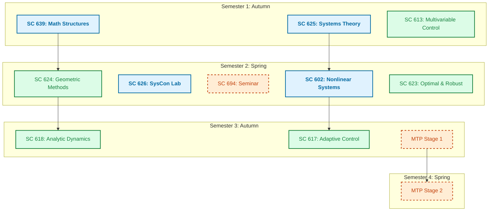
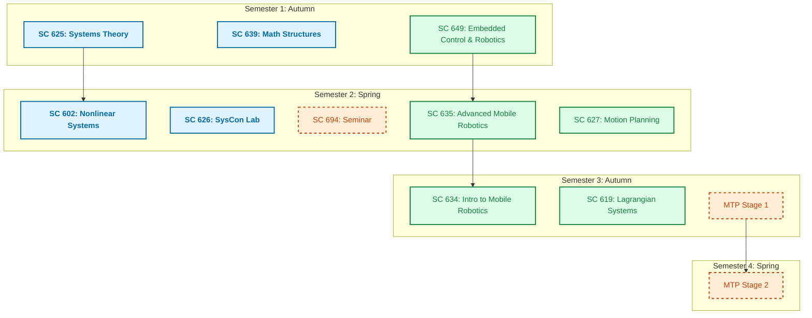
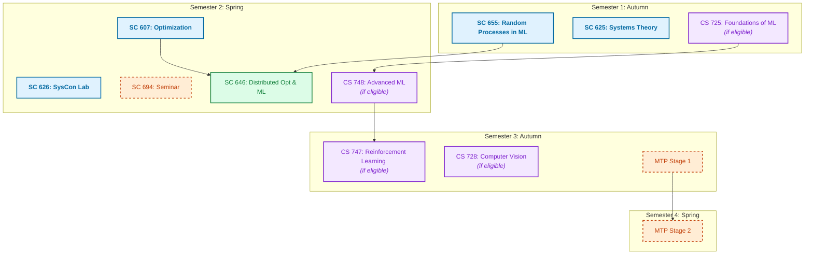
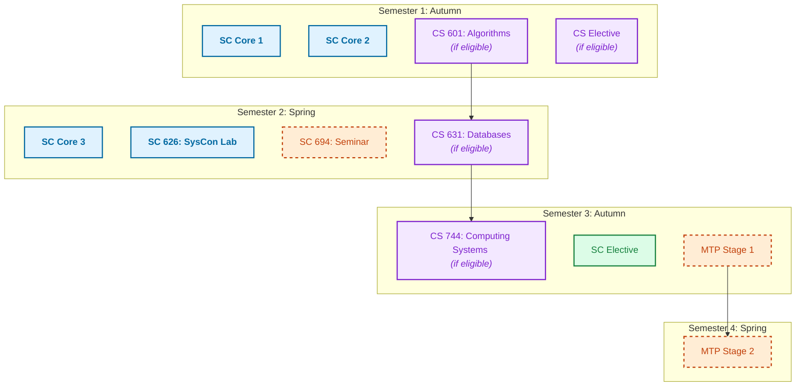
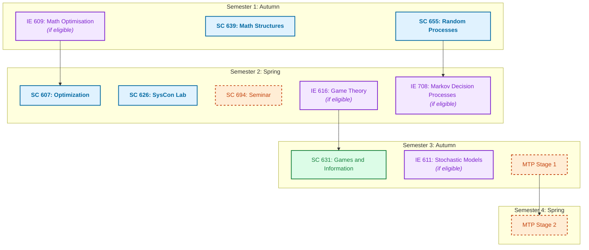

# SysCon M.Tech Curriculum Rules 📜

Before diving into the domain pathways, here is the strict structure you must follow to complete your M.Tech at SysCon:

> [!IMPORTANT]
> - **4 Core Courses** (Typically completed in Sem 1 & 2)
> - **5 Department Electives** (Spread across Sem 1 to 3)
> - **1 Lab Course** (SC 626 in Sem 2)
> - **1 Seminar** (SC 694 in Sem 2)
> - **MTP (Master's Thesis Project)** (Starts in Sem 3, concludes in Sem 4)

---

<button class="accordion-header" onclick="toggleAccordion(this)">
    1. Pure Controls & Systems Theory 🤖
    <i class="fas fa-chevron-down"></i>
</button>

This path is for students aiming for PhDs, Core Engineering jobs (ISRO, DRDO, Aerospace), or hardcore theoretical research.

<button class="accordion-header" onclick="toggleAccordion(this)">
    2. Robotics & Autonomous Systems 🦾
    <i class="fas fa-chevron-down"></i>
</button>

For students targeting robotics startups, autonomous vehicle companies, and embedded systems.

<button class="accordion-header" onclick="toggleAccordion(this)">
    3. AI, Machine Learning & Data Science 🧠
    <i class="fas fa-chevron-down"></i>
</button>

The most popular path for students targeting Data Scientist, ML Engineer, or Applied Scientist roles.

<button class="accordion-header" onclick="toggleAccordion(this)">
    4. Software Development Engineering (SDE) 💻
    <i class="fas fa-chevron-down"></i>
</button>

Focused purely on cracking top-tier software engineering placements (FAANG).

<button class="accordion-header" onclick="toggleAccordion(this)">
    5. Quantitative Finance & OR 📈
    <i class="fas fa-chevron-down"></i>
</button>

For students aiming for HFT firms, Quant Analyst roles, or supply chain optimization.

