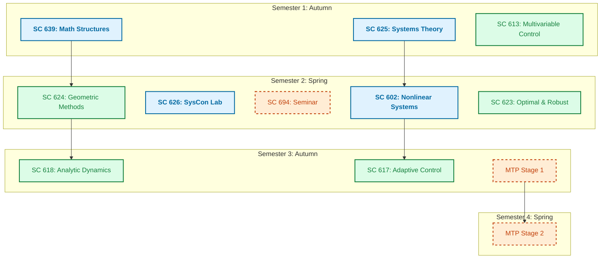
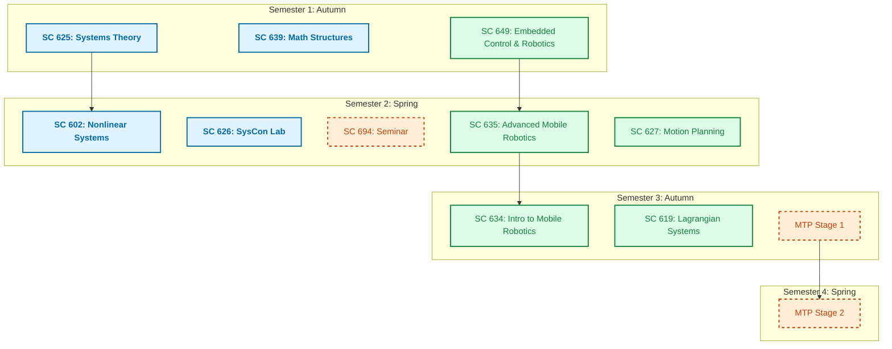
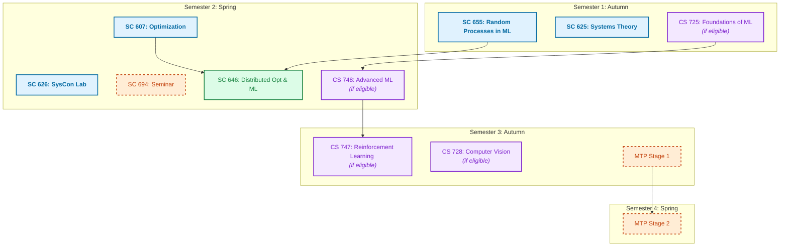
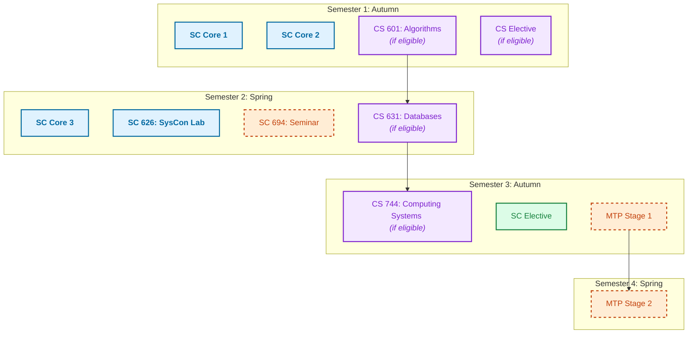
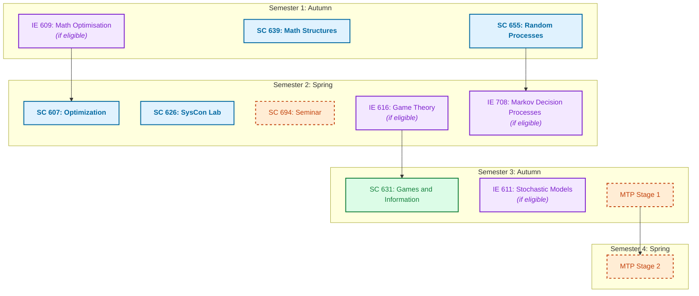

## M.Tech Curriculum Guidelines

The M.Tech program in Systems and Control Engineering requires students to complete a structured set of core and elective courses alongside a Master's Thesis Project. The curriculum is designed to provide both a strong theoretical foundation and specialized domain expertise.

### Degree Requirements
To successfully graduate, students must complete the following:

- **Core Courses (4):** Foundational coursework typically completed during Semesters 1 and 2.
- **Department Electives (5):** Specialized courses chosen based on your selected domain pathway, distributed across Semesters 1 to 3.
- **Laboratory Course (1):** SC 626 (Systems and Control Laboratory), taken in Semester 2.
- **Seminar (1):** SC 694, taken in Semester 2.
- **Master's Thesis Project (MTP):** A two-stage research project starting in Semester 3 and concluding in Semester 4.

---

1. Pure Controls & Systems Theory

This path is for students aiming for PhDs, Core Engineering jobs (ISRO, DRDO, Aerospace), or hardcore theoretical research.

2. Robotics & Autonomous Systems

For students targeting robotics startups, autonomous vehicle companies, and embedded systems.

3. AI, Machine Learning & Data Science

The most popular path for students targeting Data Scientist, ML Engineer, or Applied Scientist roles.

4. Software Development Engineering (SDE)

Focused purely on cracking top-tier software engineering placements (FAANG).

5. Quantitative Finance & OR

For students aiming for HFT firms, Quant Analyst roles, or supply chain optimization.

